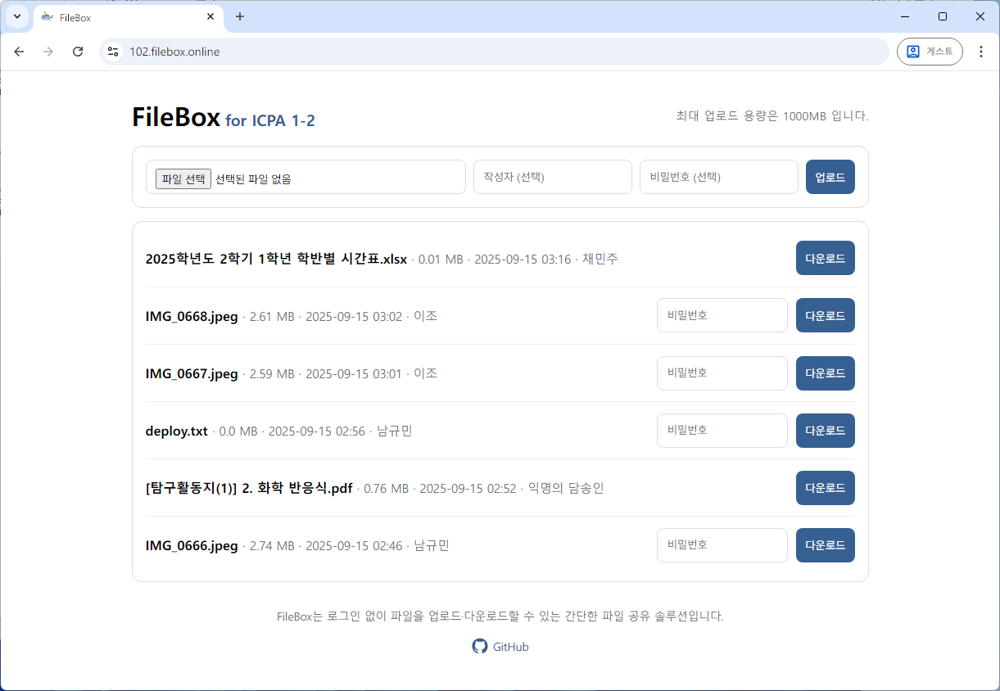
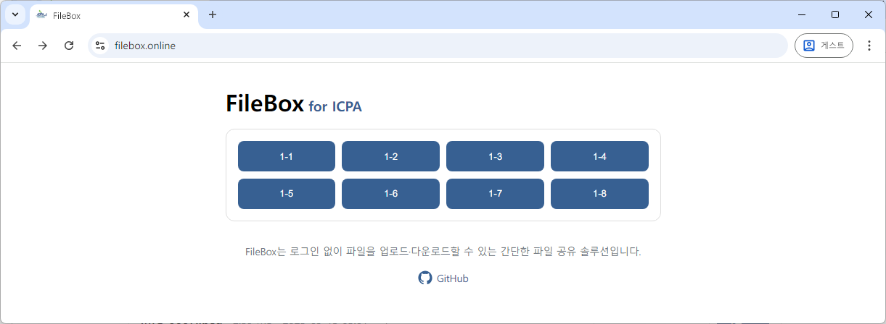

# FileBox

FileBox is a lightweight, self-hosted file sharing service.
It runs on a single Flask app `main/` and stores metadata in a simple CSV file. No login is required—open the site, upload a file, (optionally) set a password, and share the page with others to download. For multi-instance setups, an optional, customizable landing page is available in `gateway/` to link multiple FileBox nodes, and a Dockerfile is included for containerizing it if needed.

<p align="center">
  
</p>

## Features

- 📄 **Simple Web UI:** Upload and download files on a single page
- 🔒 **Optional Passwords:** Protect files with a password
- 📝 **Uploader Name:** Record who uploaded each file (optional)
- 📊 **CSV Index:** Tracks upload time, uploader, size, password (plaintext), and filename
- 🐳 **Docker Support:** Easy deployment and persistent storage

> **Security Note:** Passwords are stored as plaintext in `index.csv`.  
> Use only in trusted environments, or modify the code to hash passwords.

## Getting Started

The **core FileBox service** lives in the `main/` folder.  
Below are two common ways to run it. **Docker** is recommended for quick setup and persistence.

### A. Run with Docker

```bash
git clone https://github.com/miniprime1/FileBox.git
cd FileBox/main

docker build -t filebox:latest .
mkdir -p ./uploads

docker run -d \
  --name filebox \
  -p 8000:8000 \
  -e MAX_MB=100 \
  -e SERVICE_HOST="your name" \
  -e ANNONYMOUS_NAME="Anonymous" \
  -v "$(pwd)/uploads:/app/uploads" \
  filebox:latest
```

Visit **http://localhost:8000** (or replace `localhost` with your server/NAS IP).

### B. Run locally (Python)

```bash
cd main
python -m venv .venv
source .venv/bin/activate   # Windows: .venv\Scripts\activate
pip install Flask==3.0.3

export MAX_MB=100
export SERVICE_HOST="your name"
export ANNONYMOUS_NAME="Anonymous"

python main.py
```

Open **http://127.0.0.1:8000** in your browser.

## Configuration

| Variable           | Default       | Description                                           |
|-------------------|-------------|-------------------------------------------------------|
| `MAX_MB`          | `100`       | Maximum upload size (MB). Also shown in UI header.   |
| `SERVICE_HOST`    | *(empty)*   | Optional label shown in the header.                  |
| `ANONYMOUS_NAME` | `Anonymous` | Name displayed if no uploader is specified.          |

- **Uploads:** `/app/uploads`
- **Index file:** `/app/uploads/index.csv` (auto-created)

## Gateway (Optional)

<p align="center">
  
</p>

This repository also includes a `gateway/` folder — a simple landing page that links multiple FileBox instances (e.g., for different classes or teams).

- The gateway app is intentionally minimal and **meant to be customized** (HTML buttons, style, links).
- You can set an optional label shown in the header via the `SERVICE_HOST` environment variable (e.g., a site name or hostname).
- A [`Dockerfile`](./gateway/Dockerfile) is provided in `gateway/` so you can containerize it if needed:
  ```bash
  cd gateway
  docker build -t filebox-gateway:latest .
  docker run -d --name filebox-gateway \
    -p 8080:8000 \
    -e SERVICE_HOST="your name" \
    filebox-gateway:latest
  ```

> Because each organization or school will have different URLs and design, you should edit [`gateway/index.html`](/gateway/index.html) before deployment.

## Contributing

Contributions are welcome!  
Feel free to open issues or submit pull requests.

## License

This project is licensed under the [MIT License](LICENSE).


