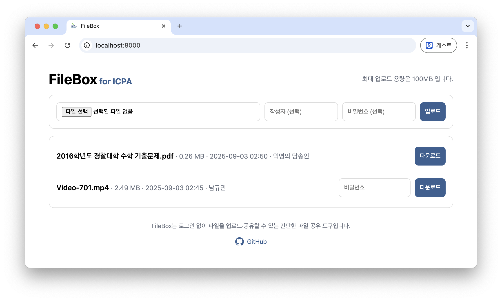

# 📦 FileBox

**FileBox** is a lightweight, self‑hosted file sharing service.  
It runs on a single Flask app and stores metadata in a simple CSV file. No login is required—open the site, upload a file, (optionally) set a password, and share the page with others to download.

<p align="center">
  
</p>

## ✨ Features

- 🖥️ **One‑page Web UI** – Upload & download in a single screen.
- 🔑 **Optional password** – Protect individual files with a simple password field.
- 📝 **Optional uploader name** – Record who uploaded each file.
- 📊 **CSV index** – Tracks upload time, uploader, size, password (plaintext by design), and filename.
- 🐳 **Docker‑ready** – Build once and run anywhere.

> **Note on security**: Passwords are stored as **plaintext** in `index.csv` by design for simplicity. Use only in trusted networks or adapt the code to hash passwords if you need stronger security.


<br>


## 🚀 Getting Started

Below are two common ways to run FileBox. **Docker** is recommended for a quick start and easy data persistence.

### A. Run with Docker (recommended)

1) **Clone the repository**  
```bash
git clone https://github.com/miniprime1/FileBox.git
cd FileBox
```

2) **Build the image** (tagged as `posdrop:latest` per project convention)  
```bash
docker build -t posdrop:latest .
```

3) **Prepare a data folder on the host**  
This folder will persist your files and the CSV index outside the container.
```bash
mkdir -p ./uploads
```

4) **Run the container**  
The app listens on port **8000** inside the container. We’ll bind it to host port **8000** and mount the data folder to **`/app/uploads`**.

```bash
docker run -d \
  --name filebox \
  -p 8000:8000 \
  -e MAX_MB=100 \
  -e SERVICE_HOST="my-server" \
  -e ANNONYMOUS_NAME="Annonymous" \
  -v "$(pwd)/uploads:/app/uploads" \
  posdrop:latest
```

- **Environment variables used here**
  - `MAX_MB`: Maximum upload size in MB (defaults to `100` if not set).
  - `SERVICE_HOST`: A short identifier shown in the header (e.g., a hostname or site label).
  - `ANNONYMOUS_NAME`: Name shown for uploads where no uploader is specified (defaults to `"Anonymous"`).
- **Storage location**
  - All uploaded files and the CSV index are written to **`/app/uploads`** inside the container (mounted to `./uploads` on your host).
  - The CSV file is `./uploads/index.csv` (automatically created on first run).

5) **Open FileBox**  
Visit **http://localhost:8000** (or replace `localhost` with your server/NAS IP if running remotely).

> **Windows PowerShell tip**: Replace `$(pwd)` with `${PWD}` in the `-v` option:
> ```powershell
> docker run -d `
>   --name filebox `
>   -p 8000:8000 `
>   -e MAX_MB=100 `
>   -e SERVICE_HOST="my-server" `
>   -e ANNONYMOUS_NAME="Annonymous" `
>   -v ${PWD}\uploads:/app/uploads `
>   posdrop:latest
> ```


### B. Run locally

1) **Create a virtual environment & install Flask**
```bash
python -m venv .venv
source .venv/bin/activate   # Windows: .venv\Scripts\activate
pip install Flask==3.0.3
```

2) **(Optional) Set environment variables**
```bash
# Linux/macOS
export MAX_MB=100
export SERVICE_HOST="ICPA"
export ANNONYMOUS_NAME="익명의 담송인"

# Windows PowerShell
$env:MAX_MB="100"
$env:SERVICE_HOST="my-server"
$env:ANNONYMOUS_NAME="Annonymous"
```

3) **Run the app**
```bash
python main.py
```
Open **http://127.0.0.1:8000** in your browser.

4) **Where files are stored**
- When running locally, files are saved under `./uploads` (created automatically).
- Metadata is recorded in `./uploads/index.csv`.

<br>

## ⚙️ Configuration Reference

### Environment Variables

| Variable       | Default | Where it appears & What it does                                    |
|----------------|---------|--------------------------------------------------------------------|
| `MAX_MB`       | `100`   | Maximum upload size (MB). Also shown in the UI header.             |
| `SERVICE_HOST` | ` `      | Optional label shown in the header.                                |
| `ANNONYMOUS_NAME` | `익명`    | Name displayed if uploader does not specify their name.        |

### Path to File Storage

- **Internal storage path**: `/app/uploads` (container) — mount this path to a host directory for persistence.  
- **Index file**: `/app/uploads/index.csv` — created automatically with headers `created_at`, `uploader`, `size`, `password`, `filename`.

<br>

## 📜 License

This project is licensed under the [MIT License](LICENSE).